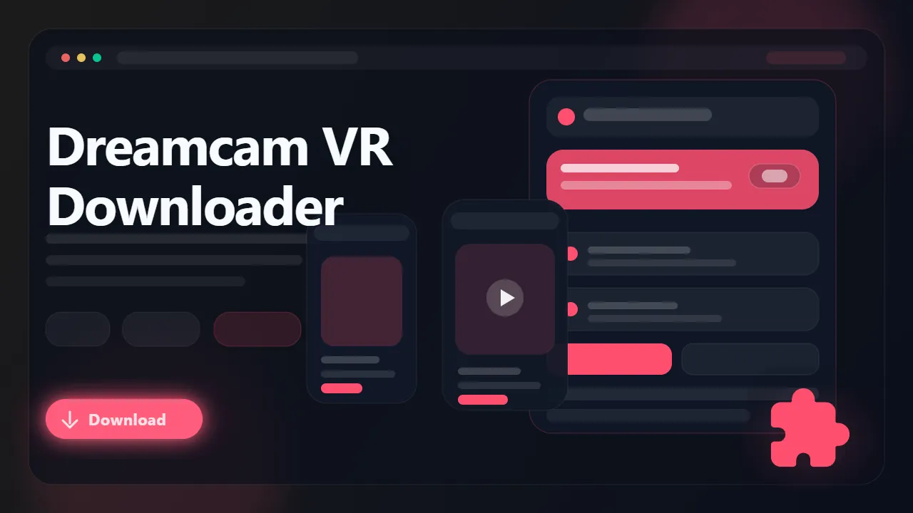

# DreamCamVR Downloader (Browser Extension)

> Record DreamCamVR live streams and download saved VR recordings as MP4 with playback-friendly metadata preserved where available.

DreamCamVR Downloader is a browser extension built for immersive video workflows. It helps you keep DreamCamVR live sessions and saved recordings available offline, while preserving useful VR playback details when the source exposes them. The result is a simpler browser-based path from live room to local MP4 file.

- Record DreamCamVR live sessions before they disappear
- Download saved VR recordings from supported performer pages
- Preserve useful VR playback metadata when the source provides it
- Choose from the stream qualities exposed on the page
- Save MP4 files for easier local playback on standard players and compatible VR setups

## Links

- 🚀 Get it here: [DreamCamVR Downloader](https://serp.ly/dreamcam-vr-video-downloader)
- 🆕 Latest release: [GitHub Releases](https://github.com/serpapps/dreamcam-vr-downloader/releases/latest)
- ❓ Help center: [SERP Help](https://help.serp.co/en/)
- 🐛 Report bugs: [GitHub Issues](https://github.com/serpapps/dreamcam-vr-downloader/issues)
- 💡 Request features: [Feature Requests](https://github.com/serpapps/dreamcam-vr-downloader/issues)

## Preview

## Table of Contents

- [Why DreamCamVR Downloader](#why-dreamcamvr-downloader)
- [Features](#features)
- [How It Works](#how-it-works)
- [Step-by-Step Tutorial: How to Download Videos from DreamCamVR](#step-by-step-tutorial-how-to-download-videos-from-dreamcamvr)
- [Supported Formats](#supported-formats)
- [Who It's For](#who-its-for)
- [Common Use Cases](#common-use-cases)
- [Troubleshooting](#troubleshooting)
- [Trial & Access](#trial--access)
- [Installation Instructions](#installation-instructions)
- [FAQ](#faq)
- [Notes](#notes)
- [About DreamCamVR](#about-dreamcamvr)

## Why DreamCamVR Downloader

VR platforms are harder to save from than normal video sites. Live sessions end, generic tools often miss the stream, and even successful captures can be frustrating later if the useful playback details are missing once the file leaves the platform.

DreamCamVR Downloader is built around that problem. It focuses on DreamCamVR pages, detects supported live and saved VR media, and exports local MP4 files while preserving VR-related playback details when they are available from the source.

## Features

- Live VR stream recording with start and stop controls
- Saved recording downloads from supported DreamCamVR pages
- VR metadata preservation when the source exposes compatible details
- Quality selection for available stream variants
- In-page controls on supported player pages
- Popup workflow for starting and managing captures
- Right-click access for a faster browser workflow
- MP4 output for easier offline viewing and transfer
- Automatic saving into a dedicated DREAMCAMVR folder
- Cross-browser support for Chrome, Edge, Brave, Opera, Firefox, Whale, and Yandex

## How It Works

1. Install the extension from the latest release.
2. Open DreamCamVR and go to a live room or saved recording page.
3. Start playback so the extension can detect the stream.
4. Open the popup or use the on-page controls.
5. Choose the quality or stream option you want.
6. Record the live session or download the saved recording.
7. Save the final MP4 file locally.

## Step-by-Step Tutorial: How to Download Videos from DreamCamVR

1. Install DreamCamVR Downloader from the latest GitHub release.
2. Open DreamCamVR and sign in if the page requires account access.
3. Visit the live room or saved VR page you want to keep.
4. Let the player load fully and press play.
5. Click the extension button or the on-page control.
6. Review the qualities detected for that stream.
7. For live sessions, start recording and stop it when the room is finished.
8. For saved recordings, click download and wait for the MP4 export to complete.
9. Open the finished file from your Downloads folder or move it to your preferred VR playback setup.

## Supported Formats

- Input: DreamCamVR live streams
- Input: DreamCamVR saved recordings
- Output: MP4

Saved files use MP4 for easier offline playback. When DreamCamVR exposes useful VR playback data, the extension keeps those details to make local viewing more consistent.

## Who It's For

- DreamCamVR viewers who want to keep live immersive sessions
- Users who want offline access to saved VR recordings
- VR viewers who care about preserving playback-friendly metadata
- People building a local archive of content they are allowed to keep
- Anyone who wants a browser-based workflow instead of manual stream capture tools

## Common Use Cases

- Record a DreamCamVR live session for later playback
- Download a saved VR recording from a performer page
- Keep local files for compatible headset playback
- Preserve useful VR playback details when the source provides them
- Save content before it rotates out or becomes unavailable

## Troubleshooting

**The extension is not detecting the stream**  
Press play first and wait a few seconds so the media has time to initialize.

**The page control is missing**  
Open the extension popup directly. Some supported pages work better through the popup UI.

**The saved file plays like a normal video**  
That usually means the source did not expose VR-specific playback metadata for that stream.

**The recording stopped early**  
Check whether the live session ended or your internet connection dropped during capture.

**The page requires login or paid access**  
The extension only works on media you can already access in your active browser session.

## Trial & Access

- Includes **3 free captures** so you can test the workflow first
- Email sign-in uses secure one-time password verification
- No credit card required for the trial
- Unlimited captures are available with a paid license

Start here: [https://serp.ly/dreamcam-vr-video-downloader](https://serp.ly/dreamcam-vr-video-downloader)

## Installation Instructions

1. Open the latest release page:
   [https://github.com/serpapps/dreamcam-vr-downloader/releases/latest](https://github.com/serpapps/dreamcam-vr-downloader/releases/latest)
2. Download the extension build for your browser.
3. Install the extension.
4. Open DreamCamVR and navigate to a live room or saved recording.
5. Use the extension controls to start recording or downloading.

## FAQ

**Can I record DreamCamVR live streams?**  
Yes. Active DreamCamVR rooms can be recorded while they are streaming.

**Can I download saved recordings too?**  
Yes. The extension supports saved DreamCamVR videos on supported pages.

**Does it preserve VR metadata?**  
Yes, when the source exposes compatible VR playback details.

**What file format do downloads use?**  
Videos are saved as MP4 files.

**Where are videos saved?**  
They are saved to your default Downloads location, typically inside a DREAMCAMVR subfolder.

**Do I need extra software?**  
No. Everything runs through the browser extension.

## Notes

- Only download content you own or have explicit permission to save
- An internet connection is required for live capture and downloads
- Live recording only works while the broadcaster is actively streaming
- Some pages may require account access or paid access
- VR metadata preservation depends on what DreamCamVR exposes for that stream

## About DreamCamVR

DreamCamVR is built around immersive live and recorded video. That makes offline saving more complex than ordinary video platforms because playback details matter once the file leaves the site. DreamCamVR Downloader was built to simplify that workflow inside the browser for users who already have legitimate access to the content.
